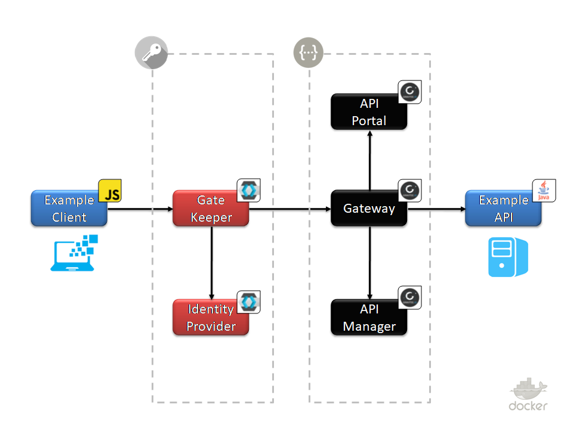

GRAVITEE KEYCLOAK STARTER	
=========================

## Description

---

## Get started

- Tools
- Remove & Create

---

## TODO

Auth gatekeeper VS gateway integration

## Roadmap

- API: SpringBoot
- App: SpringBoot
- API Manager: Gravitee
- Auth: Keycloak
- Charts: Grafana
- Identity: Midpoint

---

## See also

### External links

- Gravitee: breizhcamp-2018-tia
  - [support](https://github.com/gravitee-io/breizhcamp-2018-tia)
  - [video](https://www.youtube.com/watch?v=BQBltl5pqJo)
- https://docs.gravitee.io/apim_installguide_docker.html
- https://blog.ineat-conseil.fr/2017/12/securisez-vos-apis-spring-avec-keycloak-3-utilisation-des-connecteurs-spring-de-keycloak/
